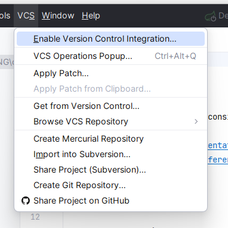
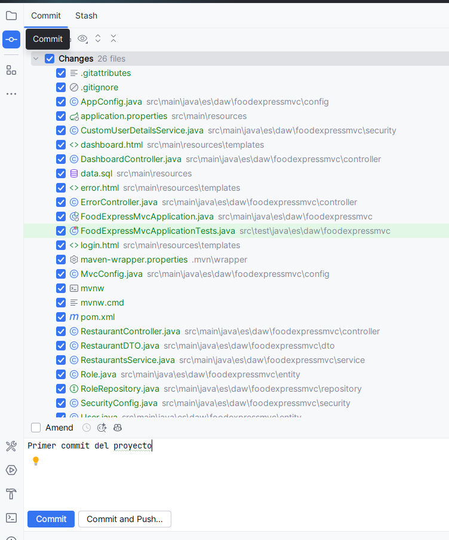
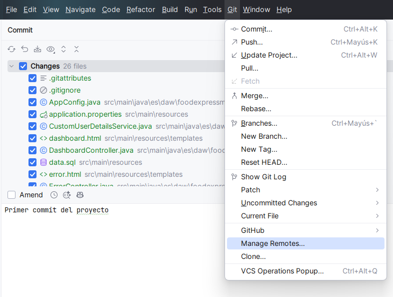
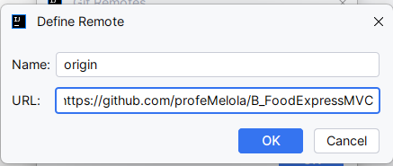
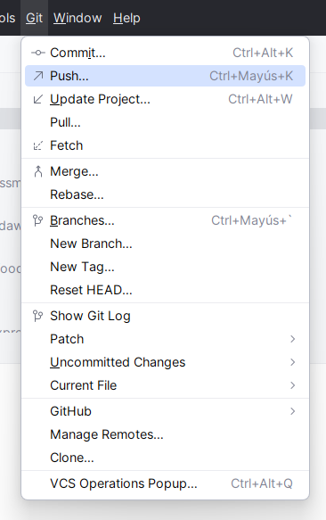
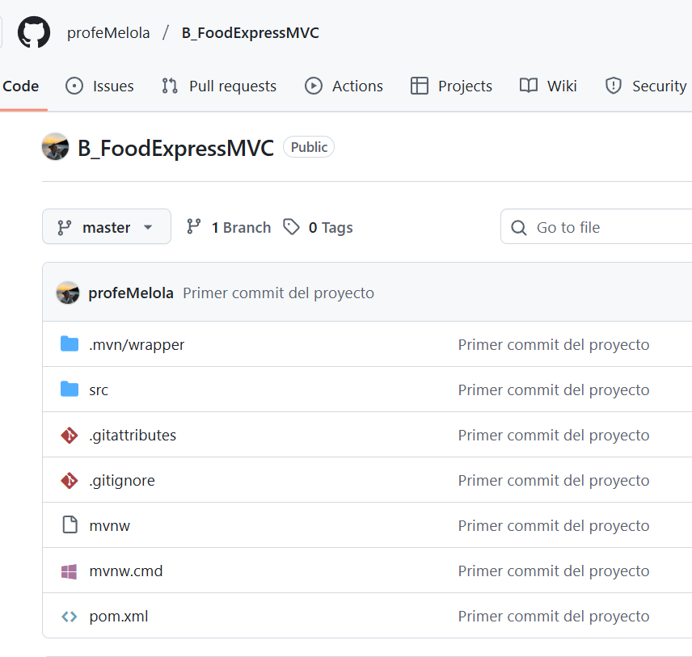

# Glosario de términos. Git y GitHub


## Glosario de términos comunes de Git y GitHub

| Término | Tipo | Descripción |
|--------|------|-------------|
| **Repository (Repo)** | Git | Carpeta que contiene el proyecto y su historial de versiones. |
| **Working Directory** | Git | Directorio local donde editas los archivos. |
| **Staging Area (Index)** | Git | Zona donde se preparan los cambios antes del commit. |
| **HEAD** | Git | Puntero que indica la rama o commit actual. |
| **Commit** | Git | Registro de cambios confirmado en el historial. |
| **Add / Stage** | Git | Añadir cambios al área de preparación (`git add`). |
| **Checkout** | Git | Cambiar de rama o restaurar archivos. |
| **Reset** | Git | Mover el HEAD y deshacer cambios en staging o working directory. |
| **Revert** | Git | Crear un commit que deshace otro sin borrar historial. |
| **Branch** | Git | Línea independiente de desarrollo. |
| **Merge** | Git | Combinar el contenido de dos ramas. |
| **Rebase** | Git | Reescribir la historia aplicando commits sobre otra base. |
| **Conflict** | Git | Conflicto que ocurre cuando Git no puede fusionar cambios automáticamente. |
| **Remote** | Git | Repositorio alojado en GitHub u otro servidor. |
| **Clone** | Git | Descargar un repositorio remoto a tu máquina. |
| **Fetch** | Git | Obtener cambios remotos sin fusionarlos aún. |
| **Pull** | Git | Obtener y fusionar cambios remotos (`fetch + merge`). |
| **Push** | Git | Enviar tus commits al repositorio remoto. |
| **Sync** | GitHub Desktop | Combina pull + push automáticamente. |
| **Tag** | Git | Marcador para identificar versiones (`v1.0.0`). |
| **Fork** | GitHub | Copia de un repo para trabajar en tu propia cuenta. |
| **Pull Request (PR)** | GitHub | Solicitud para fusionar cambios en otra rama o repositorio. |
| **Issues** | GitHub | Sistema de seguimiento de tareas y bugs. |
| **Actions** | GitHub | Automatización (CI/CD) para pruebas, builds y despliegues. |
| **Gist** | GitHub | Fragmentos de código o notas rápidas alojadas en GitHub. |
| **.gitignore** | Git | Archivo que indica qué elementos ignorar. |
| **Stash** | Git | Guardar temporalmente cambios sin hacer commit. |
| **Diff** | Git | Mostrar diferencias entre archivos, commits o ramas. |


---
# EXPLICACIÓN DE DOS USOS DIFERENTES

# 1. Subir un proyecto existente a GitHub usando IntelliJ (método gráfico)

## Paso 1: Crear un repositorio vacío en GitHub

- En GitHub → botón New repository.
- Pon un nombre.
- Importante: NO marques README, .gitignore ni licencia. (Para evitar conflictos con tu proyecto local).

## Paso 2: Abrir el proyecto en IntelliJ

Abre IntelliJ y carga el proyecto que ya tenías hecho.

## Paso 3: Inicializar Git en IntelliJ (si tu proyecto no está integrado con Git )

En IntelliJ:

- Menú VCS → Enable Version Control Integration. Solo saldrá esta opción si el proyecto no es Git.
- Elige Git.



Ahora tu proyecto ya está bajo Git.

## Paso 4: Hacer el primer commit

- Abre Commit.
- Selecciona todos los archivos.
- Escribe un mensaje: "Primer commit del proyecto"
- Pulsa Commit.



## Paso 5: Conectar tu repositorio local con GitHub

- Menú Git → Manage Remotes.



- Añade un nuevo remoto con la URL de GitHub.
- Aceptar.




## Paso 6: Hacer Push al remoto

- Menú Git → Push.
- IntelliJ mandará tu proyecto al repositorio en GitHub.
- ¡Ya está online en tu repositorio!





---

# 2. Proyecto común en clase

Cada alumno debe crear su propia copia (fork).

✔️ **Pasos para hacer un Fork**

1. Entra en el repositorio del profesor en GitHub.
2. Arriba a la derecha → botón Fork.
3. Se crea automáticamente una copia del proyecto en tu GitHub.

✔️ **Clonar el fork en IntelliJ**

1. En IntelliJ → File → New → Project from Version Control.
2. Pega la URL de tu fork (no el del profesor).
3. IntelliJ descargará el proyecto.


**Flujo actual:**

- El profesor tu repositorio principal.
- Los alumnos hacen fork.
- Los alumnos clonan su fork en local.
- El profesor avanza en el código → commit + push.
- Los alumnos sincronizan su fork (con “Sync fork” en GitHub) para recibir tus cambios.
- Los alumnos actualizan local → "update branch"
    - Caso A: No hay conflictos
        - GitHub actualiza el fork sin problema.
        - Es lo normal si el alumno solo añadió cosas en archivos que tú no tocaste.
    - Caso B: Hay conflictos
        - En cuanto modifiquen su proyecto (aunque sea una línea), al hacer “Sync fork” y luego pull tendrán conflictos si su código difiere del tuyo.
        - GitHub indicará "This branch is out-of-date with the upstream repository and has conflicts.”
        - Ofrecerá algo así: resolve conflicts, compare changes, create a merge commit...
        - El alumno decidirá:
            - Quedarse con el código del profesor y descartar el suyo.
            - Mantener el código suyo y descartar el del profesor.
            - Combinar ambos manualmente.
            - El proceso del merge queda en el fork del alumno y no afecta a nadie más.


```
                 ┌──────────────────────────┐
                 │      REPOSITORIO         │
                 │     DEL PROFESOR         │
                 │     (ORIGINAL / MAIN)    │
                 └───────────┬──────────────┘
                             │
                             │ 1. Los alumnos hacen FORK
                             ▼
        ┌────────────────────────────┐
        │  REPOSITORIO DE CADA ALUMNO│
        │          (FORK)            │
        └───────────────┬────────────┘
                        │
                        │ 2. Clone en local
                        ▼
           ┌──────────────────────────┐
           │     PROYECTO LOCAL       │
           │  (Alumno en IntelliJ)    │
           └───────┬──────────────────┘
                   │
       ┌───────────┼──────────────────────────┐
       │           │                          │
  3A. Alumno   3B. Alumno sincroniza      3C. Alumno
  programa      cambios del profesor       hace commits
  en clase       desde GitHub               y push a su fork
       │           │                          │
       └────┬──────┘                          │
            │                                  │
            ▼                                  │
   ┌───────────────────────┐                   │
   │  Sincronizar fork     │                   │
   │ (“Sync fork / Update”)│                   │
   └───────┬───────────────┘                   │
           │                                    │
     4. GitHub intenta                          │
        fusionar cambios                        │
           │                                    │
   ┌───────┴───────────────────────────────┐
   │                                       │
   ▼                                       ▼
SIN CONFLICTOS                          CON CONFLICTOS
(Merge automático)                     (GitHub pide resolver)
   │                                       │
   ▼                                       ▼
 Fork actualizado                  Alumno revisa diferencias
   │                               Decide si:
   │                               - se queda con lo suyo
   │                               - se queda con lo del profe
   │                               - combina ambos
   ▼                                       │
PROYECTO LOCAL                              ▼
`git pull` desde fork                 Fork actualizado
   │                                       │
   └───────────────────────────────────────┘
                       │
                       ▼
        Alumno sigue trabajando normalmente

```                 

## Trabajar en la rama dev (colaboración)

El profesor tendrá una rama llamada development.

Los alumnos deben trabajar SIEMPRE en esa rama.

✔️ **Paso 1: Cambiar a la rama development**

En IntelliJ:

- Abajo a la derecha, pincha en la rama (normalmente main).
- Elige development.

Si no aparece:

- Click en Remote branches
- Selecciona origin/development
- Escoge: Checkout as new local branch

✔️ **Paso 2: Crear tu propia rama de trabajo (recomendado)**

Para no pisaros entre vosotros:

1. Abajo a la derecha → Git: development
2. New Branch
3. Nómbrala según tu funcionalidad, ejemplo: endpoint/xxx

✔️ **Paso 3: Hacer tu código y tus commits**

Cada vez que avances:

1. Abre la ventana Commit.
2. Selecciona cambios.
3. Mensaje claro.
4. Pulsa Commit & Push.

## Crear un Pull Request para enviar tus cambios al proyecto del profesor

Cuando termines tu funcionalidad:

✔️ **Paso 1: Haz push de tu rama al fork**

- Menú Git → Push.
- Tu rama aparecerá en tu GitHub personal.

✔️ **Paso 2: Crear el Pull Request desde GitHub**

1. Ve a tu repositorio forkeado en GitHub.
2. Te saldrá un banner amarillo → Compare & Pull Request.
3. Asegúrate de que pone:
    - Base repository: profesor → development
    - Head repository: tu fork → tu rama feature/...
4. Escribe un mensaje explicando tu cambio.
5. Pulsa Create Pull Request.

El profesor revisará tu propuesta y decidirá:

- Hacer merge (aceptar).
- Pedir cambios.
- Rechazar si rompe el proyecto.