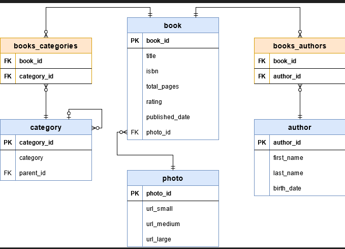

# Spring Data Rest
Spring Data REST es un módulo del ecosistema Spring que permite exponer automáticamente repositorios Spring Data JPA como un API REST, sin necesidad de escribir controladores (@RestController).

A partir de:
- entidades JPA (@Entity)
- repositorios (JpaRepository, CrudRepository, etc.)

Spring genera de forma automática:
- endpoints REST estándar
- soporte de paginación y ordenación
- endpoints de búsqueda derivados del nombre de los métodos
- navegación entre recursos mediante enlaces (HATEOAS)

Spring Data REST elimina el código repetitivo asociado a:
- controladores CRUD
- endpoints básicos (GET, POST, PUT, DELETE)
- paginación (page, size, sort)
- mapeo JSON de entidades relacionadas

## Arquitectura

En una aplicación tradicional:

```
HTTP → Controller → Service → Repository → Entity
```

Con Spring Data REST:

```
HTTP → Spring Data REST → Repository → Entity
```

## Exposición automática de recursos

Cada repositorio expuesto genera automáticamente:

| Tipo               | Ejemplo                  |
| ------------------ | ------------------------ |
| Colección          | `GET /api/books`         |
| Recurso individual | `GET /api/books/{id}`    |
| Crear              | `POST /api/books`        |
| Actualizar         | `PUT /api/books/{id}`    |
| Borrado            | `DELETE /api/books/{id}` |

Además:

- los endpoints devuelven respuestas HAL/JSON
- incluyen enlaces (_links) para navegación

## HATEOAS (Hypermedia as the Engine of Application State)

Spring Data REST sigue el principio HATEOAS, lo que implica que:

- las respuestas incluyen enlaces a recursos relacionados
- el cliente no necesita conocer URLs “a mano”
- la API es auto-descriptiva

Por ejemplo:

```
{
  "title": "Foundation",
  "_links": {
    "self": { "href": "/api/books/1" },
    "author": { "href": "/api/books/1/author" }
  }
}

```

## Paginación y ordenación

Todos los endpoints de colección soportan automáticamente:

- page
- size
- sort

```
GET /api/books?page=0&size=5&sort=title,asc
```

## Búsquedas (/search)

Spring Data REST expone automáticamente métodos de repositorio como endpoints de búsqueda bajo la ruta:

```
/api/{resource}/search
```

Por ejemplo:

```
Page<Book> findByTitleContainingIgnoreCase(String title, Pageable pageable);
```

Genera:

```
GET /api/books/search/findByTitleContainingIgnoreCase?title=foundation
```

- Basadas en query methods de Spring Data
- Soportan paginación y ordenación
- Se exponen como endpoints REST sin código extra

---

# EJERCICIO Spring Data Rest: librería

El modelo de datos está compuesto por cuatro entidades: Author, Book, Member y Loan.

Las relaciones entre entidades se definen mediante anotaciones JPA (@ManyToOne).

El diagrama entidad–relación refleja una estructura típica de biblioteca, con autores que escriben libros y socios que realizan préstamos de libros.



Relaciones: 
- Author 1 ──────── N Book
- Book   1 ──────── N Loan
- Member 1 ──────── N Loan


# Proyecto Spring Boot 4.0.1 en IntelliJ

Además de las dependencias de siempre para un proyecto Spring API Rest (no vamos a usar Spring Security), añadiremos los siguientes starters:


**Securización y CORS**

No vamos a añadir Spring Security y además no hace falta configurar CORS. ¿Por qué no necesito configurar CORS en mi entorno?

Mismo host con puerto distinto NO es el mismo origen (origin = esquema + host + puerto) y tendría que configurar CORS. Es decir:

Ahora bien, CORS solo te afecta cuando el navegador hace la petición (JavaScript fetch, axios, etc.).

En nuestra arquitectura, el consumo lo hace el servidor MVC con WebClient, es decir, una llamada server-to-server. Aquí CORS no aplica.


## Configuración

Añade en application.properties las siguientes propiedades:

```
# Spring Data REST
spring.data.rest.base-path=/api
spring.data.rest.detection-strategy=annotated
```

**spring.data.rest.base-path:** para montar urls de este tipo http://localhost:8081/api/**

**spring.data.rest.detection-strategy:** cada repositorio debe llevar la anotación @RepositoryRestResource


## Entidades

Diseñadas sin relaciones bidireccionales.

Descarga las entidades de la carpeta recursos.

## Repositorios

**@RepositoryRestResource(path = "authors")**
Indica que este repositorio debe exponerse como un recurso REST accesible en la ruta /authors

```
@RepositoryRestResource(path = "authors")
public interface AuthorRepository extends JpaRepository<Author, Long> {

    List<Author> findByFullNameContainingIgnoreCase(@Param("q") String q);
}
```

Endpoint generado: GET /api/authors/search/findByFullNameContainingIgnoreCase?q=isaac


```
@RepositoryRestResource(path = "books")
public interface BookRepository extends JpaRepository<Book, Long> {

    Page<Book> findByTitleContainingIgnoreCase(@Param("q") String q, Pageable pageable);

    Optional<Book> findByIsbn(@Param("isbn") String isbn);
}
```

- GET /api/books/search/findByTitleContainingIgnoreCase?q=foundation
- GET /api/books/search/findByIsbn?isbn=ISBN-005


```
@RepositoryRestResource(path = "members")
public interface MemberRepository extends JpaRepository<Member, Long> {

    Optional<Member> findByEmail(@Param("email") String email);
}
```

GET /api/members/search/findByEmail?email=ana@demo.com


```
@RepositoryRestResource(path = "loans")
public interface LoanRepository extends JpaRepository<Loan, Long> {

    Page<Loan> findByMemberId(@Param("memberId") Long memberId, Pageable pageable);

    Page<Loan> findByBookId(@Param("bookId") Long bookId, Pageable pageable);
}
```

- GET /api/loans/search/findByMemberId?memberId=1
- GET /api/loans/search/findByBookId?bookId=3


## Endpoints GET

```

GET http://localhost:8081/api

GET http://localhost:8081/api/books
GET http://localhost:8081/api/authors
GET http://localhost:8081/api/members
GET http://localhost:8081/api/loans


GET http://localhost:8081/api/books/3/author
GET http://localhost:8081/api/loans/1/book
GET http://localhost:8081/api/loans/1/member


GET http://localhost:8081/api/books?page=0&size=3&sort=title,asc


```

Al haber añadido la dependencia **Rest Repositories HAL Explorer**, en el navegador aparecerá algo así:


### GET http://localhost:8081/api/books/3/author

- Dame el recurso asociado author del Book con id = 3
- Permite navegar a la entidad relacionada gracias a la anotación @ManyToOne.
- Spring Data REST devuelve directamente el recurso asociado, siguiendo el principio HATEOAS, sin necesidad de escribir ningún controlador.

Obtendrás:

```
HTTP/1.1 200 
Content-Location: http://localhost:8081/api/authors/2
Content-Type: application/vnd.hal+json
Transfer-Encoding: chunked
Date: Sun, 11 Jan 2026 11:09:51 GMT

{
  "_links": {
    "self": {
      "href": "http://localhost:8081/api/authors/2"
    },
    "author": {
      "href": "http://localhost:8081/api/authors/2"
    }
  },
  "fullName": "Isaac Asimov",
  "hibernateLazyInitializer": {}
}
```

## Ejemplo de POST de Loan enlazando Book y Member (HAL)

En Spring Data REST no se envían IDs, se envían links a los recursos relacionados.

```
POST /api/loans
Content-Type: application/json
```

Body (JSON HAL):

```
{
  "loanDate": "2026-01-11",
  "dueDate": "2026-01-25",
  "book": "http://localhost:8081/api/books/3",
  "member": "http://localhost:8081/api/members/1"
}

```
- "book" apunta al recurso Book
- "member" apunta al recurso Member

Spring Data REST:

- resuelve los enlaces
- crea el Loan
- guarda las relaciones automáticamente

**Enpoints disponibles automáticamente (sin controladores):**

```
POST   /api/books
PUT    /api/books/{id}
DELETE /api/books/{id}

POST   /api/loans
PUT    /api/loans/{id}
DELETE /api/loans/{id}

```

Desde el proyecto Spring MVC, el alumno solo tiene que consumir estos endpoints, especialmente los de lectura y los POST que usan enlaces HAL para crear relaciones.

### @RestResource

Es una anotación de Spring Data REST que se usa para personalizar cómo se expone una relación o un método concreto del repositorio como recurso REST.


No define un recurso completo (eso lo hace @RepositoryRestResource), sino detalles finos de exposición.

Ejemplos:

```
@ManyToOne
@RestResource(path = "writer", rel = "writer")
private Author author;
```

Esto cambia **/api/books/{id}/author** por **/api/books/{id}/writer**


```
@ManyToOne
@RestResource(exported = false)
private Author author;
```

No se genera /api/books/{id}/author

### Qué necesitaría implementar en una aplicación Spring Boot MVC cliente para listar libros?


```
GET http://localhost:8081/api/books

HTTP/1.1 200 
Content-Type: application/vnd.hal+json
Transfer-Encoding: chunked
Date: Sun, 11 Jan 2026 11:27:50 GMT

{
  "_embedded": {
    "books": [
      {
        "_links": {
          "self": {
            "href": "http://localhost:8081/api/books/1"
          },
          "book": {
            "href": "http://localhost:8081/api/books/1"
          },
          "author": {
            "href": "http://localhost:8081/api/books/1/author"
          }
        },
        "title": "A Wizard of Earthsea",
        "isbn": "ISBN-001"
      },
      {
        "_links": {
          "self": {
            "href": "http://localhost:8081/api/books/2"
          },
          "book": {
            "href": "http://localhost:8081/api/books/2"
          },
          "author": {
            "href": "http://localhost:8081/api/books/2/author"
          }
        },
        "title": "The Tombs of Atuan",
        "isbn": "ISBN-002"
      },
      {
        "_links": {
          "self": {
            "href": "http://localhost:8081/api/books/3"
          },
          "book": {
            "href": "http://localhost:8081/api/books/3"
          },
          "author": {
            "href": "http://localhost:8081/api/books/3/author"
          }
        },
        "title": "Foundation",
        "isbn": "ISBN-003"
      },
      {
        "_links": {
          "self": {
            "href": "http://localhost:8081/api/books/4"
          },
          "book": {
            "href": "http://localhost:8081/api/books/4"
          },
          "author": {
            "href": "http://localhost:8081/api/books/4/author"
          }
        },
        "title": "Foundation and Empire",
        "isbn": "ISBN-004"
      },
      {
        "_links": {
          "self": {
            "href": "http://localhost:8081/api/books/5"
          },
          "book": {
            "href": "http://localhost:8081/api/books/5"
          },
          "author": {
            "href": "http://localhost:8081/api/books/5/author"
          }
        },
        "title": "Dune",
        "isbn": "ISBN-005"
      }
    ]
  },
  "_links": {
    "self": {
      "href": "http://localhost:8081/api/books?page=0&size=20"
    },
    "profile": {
      "href": "http://localhost:8081/api/profile/books"
    },
    "search": {
      "href": "http://localhost:8081/api/books/search"
    }
  },
  "page": {
    "number": 0,
    "size": 20,
    "totalElements": 5,
    "totalPages": 1
  }
}
```