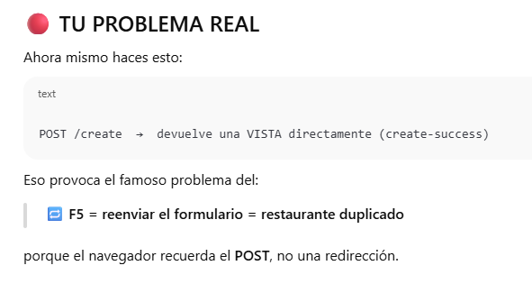
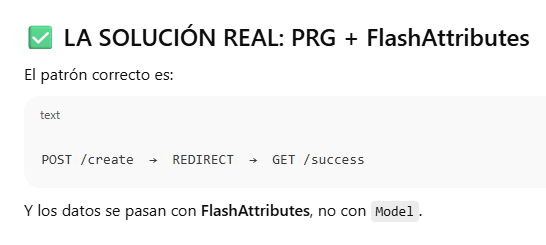

# FoodExpress 

Simula una plataforma de pedidos de comida a domicilio tipo Uber Eats /
Glovo.


Entorno completo con dos apps Spring:

- **FoodExpress API:** REST + JPA + JWT.
- **FoodExpress Web MVC:** aplicación Spring Boot MVC + Thymeleaf que consume la API.


# 1. FoodExpress I

https://github.com/profeMelola/DWES-03-2025-26/tree/main/EJERCICIOS/FoodExpress

---
# 2.  FoodExpres II

## BLOQUE A

### A.1. Spring I
- Explicación del examen.
- Introducción a Testing.

### A.2. Mejoras

#### Evitar F5-doble-submit (Post–Redirect–Get). FlashAttributes





**Get para mostrar formulario:**

```
@GetMapping("/create")
public String showForm(Model model, Principal principal) {
    model.addAttribute("username", principal.getName());
    model.addAttribute("restaurant", new RestaurantDTO());
    model.addAttribute("mode", "create");
    return "restaurants/restaurant-form";
}
```


**POST con PRG (SIN F5 DUPLICADO)**

```
@PostMapping("/create")
public String create(
        @ModelAttribute("restaurant") RestaurantDTO restaurantDTO,
        RedirectAttributes redirectAttributes) {

    RestaurantDTO saved = restaurantsService.create(restaurantDTO);

    // Se guarda temporalmente para el redirect
    redirectAttributes.addFlashAttribute("restaurant", saved);
    redirectAttributes.addFlashAttribute("success", true);

    return "redirect:/restaurants/create-success";
}

```

**Vista create-success**

```
<h1>Restaurante creado correctamente</h1>

<div th:if="${success}">
    <p>Nombre: <span th:text="${restaurant.name}"></span></p>
    <p>Dirección: <span th:text="${restaurant.address}"></span></p>
</div>

<a href="/restaurants/create">Crear otro</a>

```

Vista completa actualizada: https://github.com/profeMelola/ProyectoFoodExpress/blob/main/FoodExpress/recursosII/create-success.html

#### Componentización. Fragmentos

- Evitar duplicar HTML.
- Mejorar legibilidad.
- Centralizar errores de validación

En una app típica tienes:

- create.html
- edit.html
- restaurant-form.html
- errores de validación repetidos

Con Thymeleaf Fragments puedes:

- Reutilizar un solo formulario
- Mostrar errores de manera uniforme
- Separar el diseño del contenido
- Mejorar la mantenibilidad

**Ejemplo de fragmento de errores:**

fragments/form-errors.html:

```
<!-- Fragmento para mostrar errores de un campo concreto -->
<div th:fragment="error(field)">
    <div th:if="${#fields.hasErrors(field)}"
         class="text-danger small mt-1">
        <span th:errors="${field}"></span>
    </div>
</div>

```


Así quedaría restaurant-form.html:

```
<div class="container mt-5">

    <h2 class="mb-4" 
        th:text="${mode == 'create'} ? 'Create Restaurant' : 'Edit Restaurant'"></h2>

    <!-- Show error general -->
    <div th:if="${errorMessage}" 
         class="alert alert-danger" 
         th:text="${errorMessage}">
    </div>

    <form th:action="${mode == 'create'} 
                       ? '/restaurants/create' 
                       : '/restaurants/update/' + ${restaurant.id}}"
          th:object="${restaurant}" 
          method="post"
          class="card p-4 shadow">

        <!-- Campo Name -->
        <div class="mb-3">
            <label class="form-label">Name</label>
            <input th:field="*{name}" class="form-control" required>
            <div th:replace="~{fragments/form-errors :: error(field='name')}"></div>
        </div>

        <!-- Campo Address -->
        <div class="mb-3">
            <label class="form-label">Address</label>
            <input th:field="*{address}" class="form-control">
            <div th:replace="~{fragments/form-errors :: error(field='address')}"></div>
        </div>

        <!-- Campo Phone -->
        <div class="mb-3">
            <label class="form-label">Phone</label>
            <input th:field="*{phone}" class="form-control">
            <div th:replace="~{fragments/form-errors :: error(field='phone')}"></div>
        </div>

        <!-- Campo hidden ID solo en actualización -->
        <input type="hidden" th:if="${mode == 'update'}" th:field="*{id}"/>

        <!-- Botones -->
        <button class="btn btn-primary" 
                th:text="${mode == 'create'} ? 'Create' : 'Update'">
        </button>

        <a th:href="@{/dashboard}" class="btn btn-secondary ms-2">Cancel</a>
    </form>
</div>

```

Un paso más:

```
<div th:fragment="field(label, fieldName)">
    <div class="mb-3">
        <label class="form-label" th:text="${label}"></label>
        <input th:field="*{${fieldName}}" class="form-control">
        <div th:replace="~{fragments/form-errors :: error(field=${fieldName})}"></div>
    </div>
</div>

```

Y se usaría así:

```
<div th:replace="~{fragments/form-field :: field('Phone', 'phone')}"></div>

```

## BLOQUE B

### B.1 Paginación y sorting en Spring Data
- Pageable, PageRequest
- sort=name,asc
- Pasarlo a Thymeleaf con page.number, page.totalPages, etc.
- Hacer paginación en MVC + API REST
- Ejemplo práctico con el listado de platos.

**Práctica guiada a realizar en clase:**

```1. Vamos a recibir del API un ErrorDTO en caso de error:```

```
@Data
public class ErrorDTO {

    private LocalDateTime timestamp; // Momento del error
    private int status;              // Código HTTP (404, 400, 500...)
    private String error;            // Nombre del error: "Not Found", "Bad Request"...
    private String message;          // Mensaje detallado
    private String path;             // Endpoint que falló (/api/dishes, etc.)
}
```

```2. Spring Data devuelve un Page&lt;DishResponseDTO&gt; en el API, que en JSON similar a:```

```
{
  "content": [ ... ],
  "number": 0,
  "size": 5,
  "totalElements": 23,
  "totalPages": 5,
  "first": true,
  "last": false
}

```

```3. En la app MVC vamos a mapear dicho JSON a un DTO propio:```

```
@Data
public class PageResponse<T> {

    private List<T> content;

    private int number;         // página actual (0-based)
    private int size;           // tamaño de página
    private long totalElements; // total de registros
    private int totalPages;     // total de páginas

    private boolean first;
    private boolean last;
}

```

```4. Servicio: WebClient con paginación y manejo de errores```

- Recibir page y size en el servicio.
- Llamar al API /dishes?page=...&size=....
- Si OK → PageResponsePage&lt;DishResponseDTO&gt;.
- Si error HTTP → leer ErrorDTO y lanzar excepción propia.
- En MVC, seguiremos bloqueando al final con .block() (porque Thymeleaf + Spring MVC es síncrono).
- Uso de onStatus en el WebClient

```
@Service
@RequiredArgsConstructor
public class DishService {

    private final WebClient webClientAPI;

    public PageResponse<DishResponseDTO> getAllDishes(int page, int size) {

        try {
            return webClientAPI
                    .get()
                    .uri(uriBuilder -> uriBuilder
                            .path("/dishes")
                            .queryParam("page", page)
                            .queryParam("size", size)
                            .build()
                    )
                    .retrieve()
                    // Si el status es 4xx o 5xx, intento leer un ErrorDTO
                    .onStatus(
                            httpStatus -> httpStatus.is4xxClientError() || httpStatus.is5xxServerError(),
                            clientResponse -> clientResponse.bodyToMono(ErrorDTO.class)
                                    .defaultIfEmpty(new ErrorDTO()) // por si el body viene vacío
                                    .flatMap(errorDto -> {
                                        String msg = "Error al llamar al API /dishes: "
                                                + (errorDto.getMessage() != null ? errorDto.getMessage() : "sin detalle");
                                        return Mono.error(new ConnectionApiRestException(msg));
                                    })
                    )
                    .bodyToMono(new ParameterizedTypeReference<PageResponse<DishResponseDTO>>() {})
                    .block(); // En MVC clásico, bloqueamos aquí
        } catch (Exception e) {
            // Aquí puedes loguear o wrappear más info
            throw new ConnectionApiRestException("Fallo de comunicación con el API /dishes", e);
        }
    }
}

```

- WebClient siempre trabaja de forma reactiva y devuelve Mono.
- En Spring MVC puedes bloquear (.block()) para recuperar el dato de forma síncrona.
- Por eso se usan operadores reactivos como Mono.error, flatMap, bodyToMono:
    - son parte del pipeline interno que WebClient necesita para funcionar.
- La aplicación NO es reactiva, pero el cliente WebClient sí lo es.

[Más detalle sobre programación reactiva](
https://github.com/profeMelola/ProyectoFoodExpress?tab=readme-ov-file#c3-llamada-a-api-p%C3%BAblica-con-programaci%C3%B3n-reactiva)

```5. Controlador MVC con paginación```

El controlador tiene que:
- Recibir page y size de la URL.
- Llamar al servicio con esos valores.
- Pasar a la vista:
    - page → PageResponse&lt;DishResponseDTO&gt;
    - dishes → page.content


```
@Controller
@RequiredArgsConstructor
public class DishController {

    private final DishService dishService;

    @GetMapping("/dishes")
    public String listDishes(@RequestParam(defaultValue = "0") int page,
                             @RequestParam(defaultValue = "5") int size,
                             Model model) {

        PageResponse<DishResponseDTO> dishPage = dishService.getAllDishes(page, size);

        model.addAttribute("page", dishPage);
        model.addAttribute("dishes", dishPage.getContent());

        return "dishes/dishes";
    }
}
```

```6. Plantilla Thymeleaf con paginación```

- Partimos de tu plantilla actual y solo le metemos:
    - Uso de ```${page.content} o ${dishes} ```
    - Un bloque &lt;nav&gt; con bootstrap para botones de página, previo, siguiente.

```
    <!-- PAGINATION -->
    <nav class="mt-4" th:if="${page.totalPages > 1}">
        <ul class="pagination justify-content-center">

            <!-- Botón "Previous" -->
            <li class="page-item" th:classappend="${page.first} ? 'disabled'">
                <a class="page-link"
                   th:href="@{/dishes(page=${page.number - 1}, size=${page.size})}">
                    Previous
                </a>
            </li>

            <!-- Números de página -->
            <li class="page-item"
                th:each="i : ${#numbers.sequence(0, page.totalPages - 1)}"
                th:classappend="${i == page.number} ? 'active'">
                <a class="page-link"
                   th:text="${i + 1}"
                   th:href="@{/dishes(page=${i}, size=${page.size})}">
                </a>
            </li>

            <!-- Botón "Next" -->
            <li class="page-item" th:classappend="${page.last} ? 'disabled'">
                <a class="page-link"
                   th:href="@{/dishes(page=${page.number + 1}, size=${page.size})}">
                    Next
                </a>
            </li>

        </ul>
    </nav>

    <div class="text-center mt-4">
        <a th:href="@{/dashboard}" class="btn btn-outline-primary">Back to Dashboard</a>
    </div>

</main>
```

- #numbers.sequence(0, page.totalPages - 1) → genera los índices de páginas.
- page.number es base 0, pero i + 1 es lo que ve el usuario.
- page.first y page.last para deshabilitar prev/next.

### B.2 JPA Avanzado

- Estrategias LAZY, EAGER...
- Save vs SaveAll
- [Introducción a JPQL](https://github.com/profeMelola/DWES-03-2025-26/blob/main/APOYO_TEORIA/JPQL.md)
- Búsquedas con filtros
- Transacciones en JPA/Spring (@Transactional)


**Estrategias LAZY, EAGER**

Cuando JPA encuentra una relación entre entidades, debe decidir cuándo cargar la información relacionada:

- LAZY = cargar solo cuando se necesita.
    - JPA NO carga la relación al hacer la consulta principal.
    - En su lugar, pone un proxy (un objeto falso) que solo ejecuta la consulta cuando realmente accedes al atributo.
    - Bajo demanda.
    - Si intentas acceder fuera del contexto de persistencia (por ejemplo desde un Controller o al serializar JSON), obtienes LazyInitializationException
        - La entidad se lee en el Service (dentro de transacción)
        - Se devuelve al Controller
        - Jackson intenta hacer JSON
        - Intenta acceder a la colección LAZY
        - Solución: usa DTOs o JOIN FETCH!!!!

            - Ejemplo de error:

            En la entidad:

            ```
            @OneToMany(mappedBy = "restaurant", fetch = FetchType.LAZY)
            private List<Dish> dishes;
            ```

            En el servicio:

            ```
                // Hibernate NO carga los dishes.
                // En su lugar pone un proxy, una lista vacía especial que “se activará” cuando la uses.
                Restaurant r = restaurantRepository.findById(id).get();
            ```

            En el controlador:

            ```
                // Aquí obtendrás la excepción LazyInitializationException
                r.getDishes().size();

            ```

            - Ejemplo de solución:
                - Sigue siendo LAZY.
                - Solo cargas la relación cuando tú lo decides, no cuando Hibernate quiera.


            ```
                @Query("""
                    SELECT r FROM Restaurant r
                    JOIN FETCH r.dishes
                    WHERE r.id = :id
                """)
                Restaurant findWithDishes(Long id);

                /*
                // Lo que hibernate ejecuta internamente
                    SELECT r.*, d.*
                    FROM restaurants r
                    JOIN dishes d ON d.restaurant_id = r.id
                    WHERE r.id = ?
                */

            ```

- EAGER = cargar siempre todo desde el principio
    - Cuando haces una consulta, JPA carga inmediatamente la entidad y todas sus relaciones marcadas como EAGER, aunque NO las uses.
    - Es carga anticipada.
    - Puedes generar consultas enormes con muchos JOINs automáticamente.
    - Puedes traer de base de datos miles de registros sin necesitarlos.
    - Aumenta el tiempo de respuesta.

| Relación        | Default | ¿Recomendado?      | Motivo                             |
| --------------- | ------- | ------------------ | ---------------------------------- |
| **@ManyToOne**  | EAGER   | Debería ser LAZY | Puede cargar demasiada información |
| **@OneToMany**  | LAZY    | Mantener LAZY    | Suelen ser listas grandes          |
| **@OneToOne**   | EAGER   | Debería ser LAZY (EAGER está deprecado en la mayoría de los casos)            |                                    |
| **@ManyToMany** | LAZY    | LAZY             | Tablas de unión enormes            |

**Diferencia save y saveAll**


| Aspecto       | `save()`                   | `saveAll()`                           |
| ------------- | -------------------------- | ------------------------------------- |
| Nº entidades  | 1                          | Muchas                                |
| SQL ejecutado | 1 INSERT/UPDATE            | N INSERT/UPDATE (uno por entidad)     |
| Devuelve      | Una entidad                | Iterable de entidades                 |
| Performance   | Alta                       | Depende, puede ser lenta sin batching o bulk insert (hay que configurar jpa e Hibernate agruparía todas las entidades de saveAll en batch. Problemas con GenerationType.IDENTITY...)|
| Caso de uso   | Crear/actualizar un objeto | Insertar listas completas             |

| Método                   | ¿Hace batch?    | ¿Cuándo usarlo?                                |
| ------------------------ | --------------- | ---------------------------------------------- |
| `saveAll()` sin config   |  No            | Casos normales                                 |
| `saveAll()` + batch_size |  Sí            | Cargar grandes listas (importaciones, seeders (data.sql)) |
| JPQL bulk update/delete  |  Muy rápido    | Cambios masivos sin cargar entidades           |
| SQL nativo múltiple      |  El más rápido | Operaciones sin usar JPA ni entidades          |


## BLOQUE C

### C.1 Recuperar DTO y ErrorDTO usando WebClient.

- Procesar error 400/404 de forma limpia
- Mapear ErrorDTO
- Integrarlo en MVC (mostrar error en pantalla)


### C.2 JJWT

- Refresh Tokens
- Expiración real en el servidor (control server-side)
- Blacklist de tokens al cerrar sesión (opcional)

**POST /auth/login**
- Recibe username/password
- Genera access token (corto)
- Genera refresh token (largo)
- Guarda refresh token en BD

**POST /auth/refresh**

- Recibe refresh token
- Valida en BD
- Genera nuevo access token
- (Opcional: regenerar también el refresh token)

**POST /auth/logout**

- Borra el refresh token de BD
- Opcional: añade el access token actual a blacklist

```
| Token         | Duración      | Uso                        |
| ------------- | ------------- | -------------------------- |
| Access Token  | 10–15 minutos | Llamadas normales a la API |
| Refresh Token | 7–30 días     | Renovar sesión             |

```

### C.3 Llamada a API pública con PROGRAMACIÓN REACTIVA

Ejemplo con TheMealDB API: https://www.themealdb.com/api.php

En **MVC clásico** el flujo es así: WebClient → Mono<T>  → .block() → T

La aplicación SE QUEDA BLOQUEADA esperando la respuesta.

En **WebFlux reactivo** el flujo es así: WebClient → Mono<T> → se devuelve tal cual → WebFlux sigue trabajando sin bloquear

El servidor NO se bloquea, y puede atender más peticiones con menos hilos.

Mientras WebClient espera la respuesta de un API externo, tu servidor NO está bloqueado y puede seguir atendiendo más peticiones.


| Característica      | MVC clásico (bloqueante) | WebFlux (reactivo / no bloqueante) |
| ------------------- | ------------------------ | ---------------------------------- |
| Modelo de ejecución | Un hilo por petición     | Hilos compartidos (event loop)     |
| WebClient           | `.block()`               | Devuelve `Mono`                    |
| Rendimiento         | Limitado por hilos       | Escalable, miles de conexiones     |
| Consumidores        | Navegadores, plantillas  | Micros, SPA, streaming             |
| Flujo               | síncrono                 | asíncrono                          |
| Escalabilidad       | moderada                 | muy alta (Node.js style)           |


**MVC + .block() (modo clásico)**

- El servidor espera la respuesta del API antes de continuar.
- Cada petición ocupa un hilo
- Más lento si hay muchas llamadas a APIs externas
- Ideal para Thymeleaf, HTML server-side

**WebFlux + reactivo (modo moderno)**

- El servidor NO espera; sigue atendiendo otras peticiones.
- Más eficiente para microservicios
- Menos hilos → más escalable
- Flujos asíncronos (Mono / Flux)
- Perfecto microservicios, integración de APIs externas, streaming, aplicaciones altamente concurrentes

**En una app MVC clásica con Thymeleaf, un servicio reactivo NO aporta nada**

Porque en MVC:

- El controlador necesita los datos antes de renderizar la vista.
- Thymeleaf no puede procesar un Mono.
- La petición se completa solo cuando tienes el modelo lleno.

**¿Cuándo tiene mucho más sentido usar WebFlux?**

- API Gateway (frontend → gateway → services)

```
Frontend → API Gateway (Spring Cloud Gateway o Kong o NGINX)
          → Servicio Usuarios
          → Servicio Pedidos
          → Servicio Productos
```

- Microservicios que llaman a otros microservicios
- Llamadas concurrentes a varias APIs externas


Por ejemplo, pedir 3 endpoints externos a la vez:

- /categories
- /meals
- /areas

Con WebFlux: Mono.zip(service.getMeals(), service.getCategories(), service.getAreas())

Con MVC clásico:

- Harías 3 llamadas síncronas
- Esperarías a que cada una terminara antes de la siguiente

**Práctica guiada:**

Usar WebClient de forma reactiva solo en el API REST, devolviendo JSON.

- NO usar WebFlux en el MVC.
- NO convertir toda la aplicación en reactiva (se escapa del ámbito del curso).
- Solo un endpoint concreto usando programación reactiva real.

```
GET /api/meal-info?meal=Arrabiata

```

Dos llamadas en paralelo:

- /search.php?s=Arrabiata — info del plato
- /categories.php — categorías

Y obtener algo así:

```
{
  "meal": { ... },
  "categories": [ ... ]
}

```

Servicio reactivo:

```
@Service
@RequiredArgsConstructor
public class MealService {

    private final WebClient webClient = WebClient.create("https://www.themealdb.com/api/json/v1/1");

    public Mono<MealResponseDTO> getMeal(String meal) {
        return webClient.get()
                .uri(uri -> uri.path("/search.php").queryParam("s", meal).build())
                .retrieve()
                .bodyToMono(MealResponseDTO.class);
    }

    public Mono<CategoryResponseDTO> getCategories() {
        return webClient.get()
                .uri("/categories.php")
                .retrieve()
                .bodyToMono(CategoryResponseDTO.class);
    }

    public Mono<MealCombinedDTO> getMealWithCategories(String meal) {
        return Mono.zip(
                getMeal(meal),
                getCategories()
        ).map(tuple -> new MealCombinedDTO(tuple.getT1(), tuple.getT2()));
    }
}

```

Controlador REST reactivo:

```
@RestController
@RequiredArgsConstructor
@RequestMapping("/api")
public class MealController {

    private final MealService mealService;

    @GetMapping("/meal-info")
    public Mono<MealCombinedDTO> getMealInfo(@RequestParam String meal) {
        return mealService.getMealWithCategories(meal);
    }
}

```

En un futuro:

| Tipo        | Significa                    | Emite        | Uso típico                       |
| ----------- | ---------------------------- | ------------ | -------------------------------- |
| **Mono<T>** | promesa de *un valor* futuro | 0..1 valores | llamadas HTTP, logins, consultas |
| **Flux<T>** | secuencia de valores         | 0..N valores | streaming, listas, colas         |


La inmensa mayoría de las llamadas HTTP devuelven:
- un único JSON
- o un error

## BLOQUE D — Upload/Storage de ficheros, caché, loggin, email..

### D.1 Upload de imágenes / MultipartFile

- Formulario con ```<input type="file">```
- Manejo en controller (MultipartFile)
- Guardarlo en /uploads o en base64
- Mostrarlo en la web.
- Muy útil para el proyecto FoodExpress (fotos de restaurantes, platos…).

### D.2 Caching + Logging

- @Cacheable para búsquedas típicas
- Logging con SLF4J. AOP (Programación Orientada a Aspectos)
    - AOP permite ejecutar código automáticamente antes o después de ciertos métodos, sin modificar esos métodos.
- Buena práctica: logs de error, info, debug.

### D.3 Envío de email básico

- Spring Mail sender
- Plantilla simple
- Ejemplo: email de confirmación de registro

### D.4 Spring Data Rest + Swagger/OpenAPI

- Mostrar cómo Spring genera una API REST completa
- Paginated + HATEOAS
- Integrarlo con Swagger UI


---

# 4. Dockerizar todo el entorno
`
Un docker-compose.yml con 3 contenedores principales:

| Servicio               | Descripción                                                                       | Imagen base               |
| ---------------------- | --------------------------------------------------------------------------------- | ------------------------- |
| 🧩 **foodexpress-api** | La API REST (Spring Boot, puerto 8081). Expone endpoints REST + JWT + JPA.        | `openjdk:21-jdk-slim`     |
| 🌐 **foodexpress-web** | La aplicación MVC (Thymeleaf, puerto 8080). Consume la API vía HTTP.              | `openjdk:21-jdk-slim`     |
| 🗄️ **foodexpress-db** | Base de datos relacional persistente (reemplaza H2) → **PostgreSQL** o **MySQL**. | `postgres:16` / `mysql:8` |

---

# 5. Microservicios

| Tema            | API REST (monolito) | Microservicios            |
| --------------- | ------------------- | ------------------------- |
| Nº aplicaciones | 1                   | Muchas ✖                  |
| BD              | Una                 | Una por servicio          |
| Seguridad       | Simple              | Compleja (gateway + auth) |
| Comunicación    | Interna, rápida     | HTTP, eventos             |
| Escalado        | Completo            | Por servicio              |
| Deploy          | Muy fácil           | Complejo                  |
| Complejidad     | Baja                | Alta                      |


```
                    +-----------------------------+
                    |    API Gateway (Spring)     |
                    |  http://api.foodexpress.com |
                    +-------------+---------------+
                                  |
    -----------------------------------------------------------------
    |               |                   |                  |
    v               v                   v                  v
+---------+   +-----------+     +----------------+   +-----------------+
| Auth    |   | Users     |     | Restaurants    |   | Orders          |
| Service |   | Service   |     | Service        |   | Service         |
+---------+   +-----------+     +----------------+   +-----------------+
| JWT     |   | CRUD users|     | CRUD restaurants|  | Gestion pedidos |
| issuing |   | Roles     |     | Menús / dishes |   | Estado pedidos  |
+---------+   +-----------+     +----------------+   +-----------------+
     |                                                  |
     |        +------------------------+                 |
     |        | Notification Service   | <---------------+
     |        +------------------------+    Envía eventos (Kafka/Rabbit)

```

Cada microservicio tiene su propia BD:

```
auth_db      users_db      restaurants_db      orders_db      notifications_db

```

