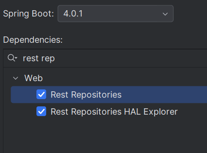

# Ejercicio con transacciones JPA 

Operaciones que deben ir juntas:
- Crear el Order
- Crear varios OrderDetail
- Calcular subtotales
- Guardar todo

Si falla cualquier paso → no debe guardarse nada.

## Crear un pedido completo

Implementa el método createOrder() de forma que:

- Cree un pedido (Order)
- Cree todos sus detalles (OrderDetail)
- Calcule correctamente los subtotales
- Todas las operaciones deben ejecutarse dentro de una única transacción.
- Si ocurre cualquier error durante el proceso, no debe guardarse ningún dato en la base de datos.

### DTOs de entrada

```
public record CreateOrderDTO(
        Long userId,
        Long restaurantId,
        List<OrderItemDTO> items
) {}

```

```
public record OrderItemDTO(
        Long dishId,
        Integer quantity
) {}

```

### Servicio con transacción. Crear un pedido completo

```
@Service
public class OrderService {

    private final OrderRepository orderRepository;
    private final OrderDetailRepository orderDetailRepository;
    private final UserRepository userRepository;
    private final RestaurantRepository restaurantRepository;
    private final DishRepository dishRepository;

    @Transactional
    public OrderCreatedResponseDTO createOrder(CreateOrderDTO dto) {

        // Cargar agregados principales
        User user = userRepository.findById(dto.userId())
                .orElseThrow(() -> new EntityNotFoundException("User not found: " + dto.userId()));

        Restaurant restaurant = restaurantRepository.findById(dto.restaurantId())
                .orElseThrow(() -> new EntityNotFoundException("Restaurant not found: " + dto.restaurantId()));

        // Crear Order
        Order order = new Order();
        order.setUser(user);
        order.setRestaurant(restaurant);
        order.setStatus(OrderStatus.CREADO);
        order.setOrderDate(LocalDateTime.now());

        orderRepository.save(order);

        // Crear detalles
        BigDecimal total = BigDecimal.ZERO;
        List<OrderLineResponseDTO> responseLines = new ArrayList<>();

        for (OrderItemDTO item : dto.items()) {

            Dish dish = dishRepository.findById(item.dishId())
                    .orElseThrow(() -> new EntityNotFoundException("Dish not found: " + item.dishId()));

            // Validar que el plato pertenece al restaurante del pedido
            if (dish.getRestaurant() == null || dish.getRestaurant().getId() == null ||
                !dish.getRestaurant().getId().equals(dto.restaurantId())) {
                throw new IllegalArgumentException("Dish " + dish.getId() + " does not belong to restaurant " + dto.restaurantId());
            }

            BigDecimal unitPrice = dish.getPrice(); // o dish.getBasePrice() / price final según tu modelo
            if (unitPrice == null) {
                throw new IllegalStateException("Dish price is null for dishId=" + dish.getId());
            }

            int qty = item.quantity();
            BigDecimal subtotal = unitPrice.multiply(BigDecimal.valueOf(qty));

            OrderDetail detail = new OrderDetail();
            detail.setOrder(order);
            detail.setDish(dish);
            detail.setQuantity(qty);
            detail.setSubtotal(subtotal);

            // CLAVE: inicializar el EmbeddedId
            detail.setOrderDetailId(new OrderDetailId(order.getId(), dish.getId()));

            orderDetailRepository.save(detail);

            total = total.add(subtotal);

            responseLines.add(new OrderLineResponseDTO(
                    dish.getId(),
                    dish.getName(),
                    unitPrice,
                    qty,
                    subtotal
            ));
        }


        // Respuesta
        return new OrderCreatedResponseDTO(
                order.getId(),
                user.getId(),
                restaurant.getId(),
                //order.getStatus(),
                order.getStatus().name(),
                order.getOrderDate(),
                total,
                responseLines
        );
    }
}

```
- Spring abre una transacción al entrar al método.
- Si falla cualquier save() → rollback automático.
- No queda ningún pedido “a medias”.
- Spring solo hace rollback automático con RuntimeException y Error, no con Exception (excepciones checked).
    - Si la excepción es checked entonces: @Transactional(rollbackFor = Exception.class)


**Ejemplo llamada al endpoint para crear un pedido completo:**





Si probamos con el siguiente json dará error porque el plato no corresponde al restaurante en cuestión y veremos cómo funciona el rollback de la transacción:

```
{
          "userId": 1,
          "restaurantId": 2,
          "items": [
            { "dishId": 10, "quantity": 2 },
            { "dishId": 12, "quantity": 1 }
          ]
        }
```

## @Transactional en consultas (solo lectura)

Para consultas complejas JPQL:

```
@Transactional(readOnly = true)
public List<OrderSummaryDTO> getOrderSummaries() {
    return orderRepository.findAllOrderSummaries();
}

```

- Menor consumo
- Hibernate optimiza la sesión
- Buen hábito profesional